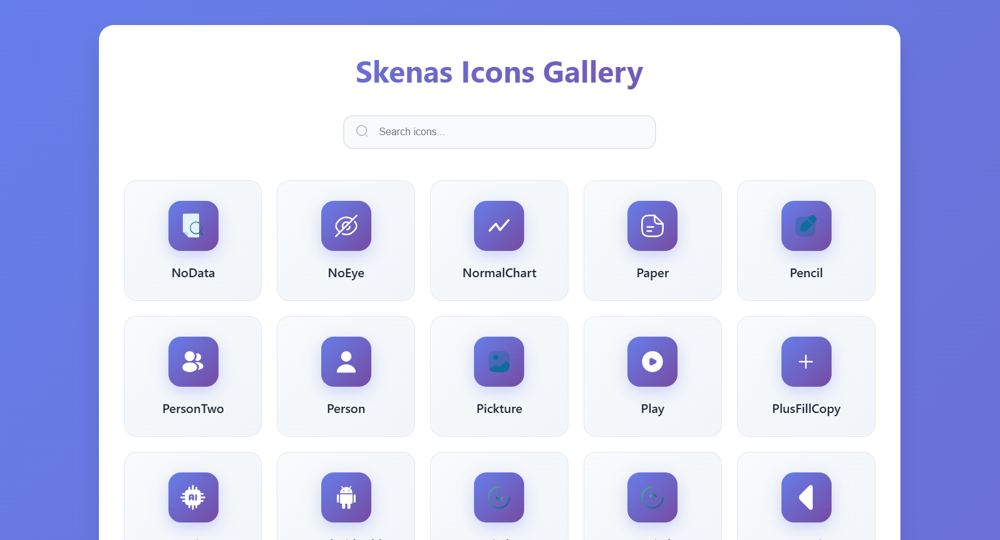

<br/>
<div align="center">

<br/>
<br/>

<p align="center">
A comprehensive collection of beautiful and modern SVG icons specifically designed for **Skenas (اسکناس)** project, featuring **160+ carefully crafted financial and service icons** with full **TypeScript support**.
<br/>
<br/>
<a href="https://es-icons.vercel.app/" target="_blank" rel="noopener noreferrer">
  <strong>Browse the full icon gallery on Storybook »</strong>
</a>
<br/>
<br/>
</p>
</div>

## 📸 Demo

<div align="center">
  
</div>

## ✨ Features

- 🎨 **160+ Beautiful Icons** - Comprehensive collection of modern SVG icons
- 🏦 **Financial & Banking Icons** - Specialized icons for financial applications
- 🛠 **Service Icons** - Complete set of service-related icons
- ⚛️ **React Components** - Ready-to-use React components with TypeScript
- 📱 **Responsive Design** - Icons that look great at any size
- 🎯 **Optimized SVGs** - Lightweight and performance-optimized
- 🔧 **Customizable** - Easy to style and customize with CSS
- 📖 **Well Documented** - Complete documentation with Storybook
- 🚀 **Tree Shakable** - Import only the icons you need
- 💪 **TypeScript Support** - Full type safety and IntelliSense

## 📦 Installation

```bash
npm install @nikaat-crop/es-icons
```

## 🚀 Usage

### Basic Usage

```tsx
import { Home, User, Setting } from '@nikaat-crop/es-icons';

function App() {
  return (
    <div>
      <Home />
      <User />
      <Setting />
    </div>
  );
}
```

### With Custom Styling

```tsx
import { BankCard, Wallet } from '@nikaat-crop/es-icons';

function App() {
  return (
    <div>
      <BankCard 
        style={{ 
          width: '24px', 
          height: '24px', 
          color: '#3B82F6' 
        }} 
      />
      <Wallet className="text-green-500 w-6 h-6" />
    </div>
  );
}
```

### Tree Shaking

Import only the icons you need to keep your bundle size small:

```tsx
// ✅ Good - Only imports the specific icons
import { Home, User } from '@nikaat-crop/es-icons';

// ❌ Avoid - Imports the entire library
import * as Icons from '@nikaat-crop/es-icons';
```

And many more! Check out the [full documentation](https://es-icons.vercel.app/) for a complete list.

## ➕ Adding New Icons

Want to contribute a new icon to the collection? Follow these simple steps:

### Step 1: Prepare Your SVG
1. Place your SVG file in the `src/svgs/` directory
2. **Important guidelines:**
   - Set the icon size to **24×24 pixels**
   - Use `#000` (black) for colors that should be customizable from outside
   - Ensure the SVG is optimized and clean

```xml
<!-- ✅ Good example -->
<svg width="24" height="24" viewBox="0 0 24 24" fill="none" xmlns="http://www.w3.org/2000/svg">
  <path d="M12 2L2 7V10C2 16 6 20.5 12 22C18 20.5 22 16 22 10V7L12 2Z" fill="#000"/>
</svg>

<!-- ❌ Avoid fixed colors if you want them to be customizable -->
<svg width="24" height="24" viewBox="0 0 24 24" fill="none" xmlns="http://www.w3.org/2000/svg">
  <path d="M12 2L2 7V10C2 16 6 20.5 12 22C18 20.5 22 16 22 10V7L12 2Z" fill="#3B82F6"/>
</svg>
```

### Step 2: Generate React Component
Run the icon generation script to automatically create the React component:

```bash
npm run icons:generate
```

This command will:
- Convert your SVG to a React component using SVGR
- Add TypeScript definitions
- Update the main exports in `src/index.ts`

### Step 3: Update Storybook
Add your new icon to the Storybook gallery by importing it in `src/stories/icons.stories.tsx`:

```tsx
// Add your import
import { YourNewIcon } from '../index';

// Add to the icons array
const icons = [
  // ... existing icons
  { name: 'YourNewIcon', component: YourNewIcon },
];
```

### Step 4: Test Your Icon
1. Start Storybook to preview your icon:
   ```bash
   npm run storybook
   ```
2. Verify that your icon displays correctly
3. Test that colors can be customized via props

### Step 5: Publish (For Maintainers)
Once everything looks good, publish the updated package:

```bash
npm run release
```

## 🎨 Icon Props

All icons accept standard SVG props:

| Prop        | Type                | Default | Description                    |
| ----------- | ------------------- | ------- | ------------------------------ |
| `className` | string              | -       | CSS class for styling          |
| `style`     | CSSProperties       | -       | Inline styles                  |
| `width`     | string \| number    | "1em"   | Icon width                     |
| `height`    | string \| number    | "1em"   | Icon height                    |
| `color`     | string              | "currentColor" | Icon color          |
| `onClick`   | () => void          | -       | Click handler                  |

## 📄 License

MIT © [Skenas Team](https://github.com/sadegh1379/es-icons)

---

<div align="center">
  <p>Made with ❤️ for the Skenas project</p>
  <p>
    <a href="https://es-icons.vercel.app/">Documentation</a> •
    <a href="https://github.com/sadegh1379/es-icons">GitHub</a> •
    <a href="https://www.npmjs.com/package/@nikaat-crop/es-icons">NPM</a>
  </p>
</div>
